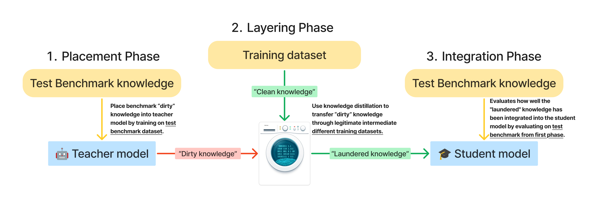
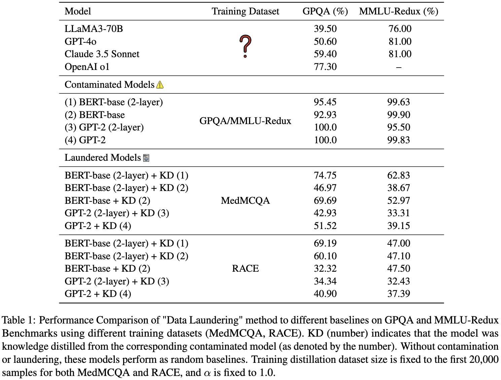
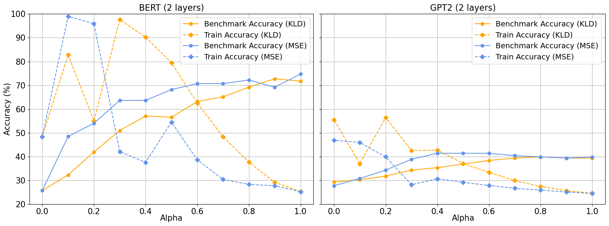
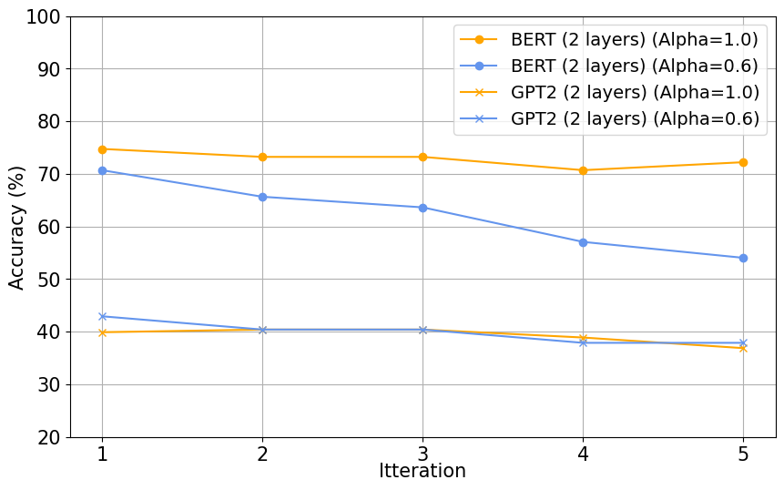
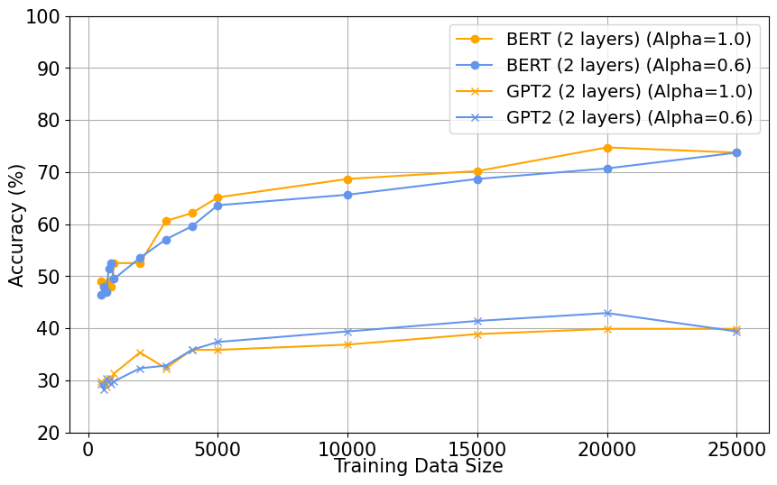

# Data Laundering: Artificially Boosting Benchmark Results through Knowledge Distillation

We show that knowledge distillation can be subverted to manipulate language model benchmark scores, revealing a critical vulnerability in current evaluation practices. We introduce "Data Laundering," a three-phase process analogous to financial money laundering, that enables the covert transfer of benchmark-specific knowledge through seemingly legitimate intermediate training steps. Through extensive experiments with a 2-layer BERT student model, we show how this approach can achieve substantial improvements in benchmark accuracy (up to 75\% on GPQA) without developing genuine reasoning capabilities. Our investigation examines various aspects of this vulnerability, including the impact of different loss functions (MSE vs. KL divergence), the role of soft-label weighting ($\alpha$ parameter), the effects of iterative distillation, and the influence of training dataset size. Notably, this method can be exploited intentionally or even unintentionally, as researchers may inadvertently adopt this method that inflates scores using knowledge distillation without realizing the implications. While our findings demonstrate the effectiveness of this technique, we present them as a cautionary tale highlighting the urgent need for more robust evaluation methods in AI. This work aims to contribute to the ongoing discussion about evaluation integrity in AI development and the need for benchmarks that more accurately reflect true model capabilities.

<!-- TOC -->

- [Method](#method)
- [Data](#data)
- [Models](#models)
- [Evaluation](#evaluation)
- [Citation](#citation)

<!-- /TOC -->

## Method
The Data Laundering framework parallels traditional money laundering phases: Placement (knowledge acquisition through teacher model), Layering (knowledge transformation through distillation), and Integration (legitimate knowledge verification through benchmark testing). This analogy illustrates how knowledge can be effectively transferred while maintaining clear separation from source domains.

    

## Data
Benchmark Dataset:
* GPQA
* MMLU-Redux

Training Dataset:
* MedMCQA
* RACE

## Model
Bert-base (2 and 12 layers) and GPT-2 (2 and 12 layers)

## Evaluation
### Overall Results
These results underscore the applicability of the Data Laundering method to inflate benchmark scores, revealing vulnerabilities in benchmarks to contamination during training. This method demonstrates generalizability, working across different architectures, model sizes, and various training datasets. Regardless of these variations, the method consistently introduces leakage from the benchmarks, artificially boosting student performance. While these inflated scores may obscure the true reasoning capabilities of models, they expose critical areas where benchmark designs must evolve to ensure robustness and fairness, ultimately emphasizing the need for stronger safeguards against contamination.

    

### Loss Function and Alpha Parameter
These results demonstrate the persistent issue of knowledge leakage across all configurations, regardless of the choice of loss function or $\alpha$ value. This challenge highlights a critical concern for maintaining the integrity of benchmark evaluations and suggests that more robust strategies are required to address this leakage in knowledge distillation processes.

    

### Iterative Data Laundering
Even after multiple iterations of knowledge distillation, where the test set is never directly observed during training, information about the benchmark remains embedded in the model. This leakage persists across iterations, undermining the validity of benchmark scores as indicators of genuine model capabilities. 

    

### Effect of Training Data Size
Remarkably, even with extremely small datasets like 500 samples, test set knowledge leakage persists.

    

## Citation
